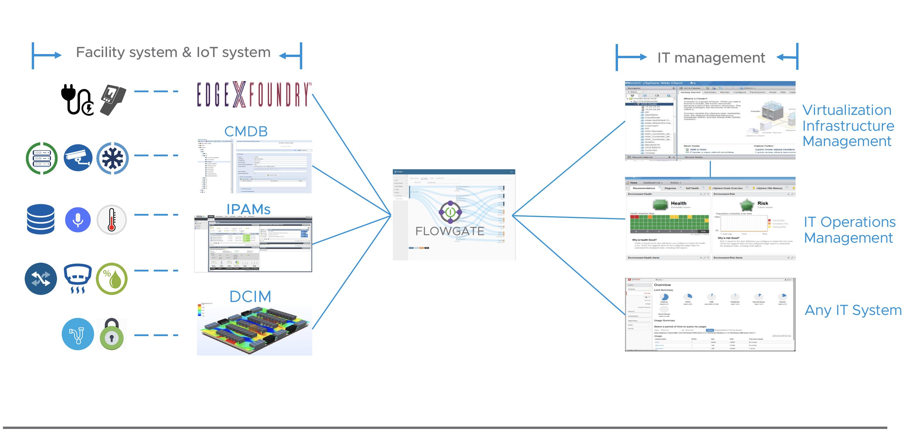

# Flowgate

# 
Project FlowGate is an open source vendor-neutral project that helps enterprises integrate facility systems data and IT data to form a single holistic view of their operations. By combining these two disparate data sets into one view, data center managers are better equipped to optimize operations and make smarter choices about workload placement.
With Project Flowgate, we can fetch metadata and runtime metrics from various facility systems like DCIM and CMDB (Configuration Management Database), process the data from IT systems, correlate both together, and then push the results to IT infrastructure management and operation management systems. In that way, IT administrators can see updated data from facilities for IT assets in one single pane of glass. They can also view and analyze additional resources such as: power supply, cooling capacity, temperature/moisture situation for every specific server, and conduct many “facility-awared” operations, which were previously impossible.

# Why
* In enterprise data centers, IT infrastructure and facility are generally managed separately, which leads to information gaps.
* Collaboration between facility and IT infrastructure systems are limited or manual, and virtualization adds more complexity.
* More and more workloads move into off prime colos or clouds where infrastructure are managed via outsourcing, making more gaps.
* Sound IT operations management and automation decisions may not be the best choice if not consider power, cooling or environmental constrains. 
## Features
* **Built-in adapter for multiple DCIM and CMDB system integration.** 
  - Nlyte 
  - PowerIQ 
  - Infoblox 
  - Labsdb
  - IBIS(TODO)
  - Open for other facility system integration.
* **Built-in adapter for multiple IT stack systems**
  - vCenter Server
  - Aria Operation Manager
  - Management Pack for Aria Operation Manager Pack  ( Totally Free, [Download Here](https://marketplace.cloud.vmware.com/services/details/aaa?slug=true)) 
  - Open for other IT stack integration. More systems will coming soon.
* **UI based Integration proccess**  One click integration. 
* **Role based access control** API level access control support. 
* **RestAPI support** Provide unified facility information querying services. APIs for all operations and data query make it easy to integrate with other systems.
## Get Start
**DEMO**

[Flowgate Management Pack Demo](https://github.com/yixingjia/wormhole/releases/download/1.0/Flowgate_and_vROPs_Management_Pack_Demo.mp4)

[Demo Flowgate v1.1.2](https://github.com/yixingjia/wormhole/releases/download/1.0/Flowgate1.1.2Update.mp4) or [https://youtu.be/REbDV4Pu_-c](https://youtu.be/REbDV4Pu_-c)

[Demo Flowgate v1.0](https://github.com/yixingjia/wormhole/releases/download/1.0/Flowgate_V1.0.mp4)

[Integrate with EdgeXfoundry](https://github.com/yixingjia/wormhole/releases/download/1.0/VBC_Demo_0.5_720.mp4)

**Install from Source code**
[Compilation document](docs/compile_guide.md)

**Install from binary**
[Installation document](docs/installation_guide.md)

**System architecture**
[Architecture document](https://github.com/yixingjia/wormhole/releases/download/1.0/Flowgate_public_technical.pdf)

**User Document**
[Document](docs/user_guide.md)

## Contributing

The Flowgate project team welcomes contributions from the community. Before you start working with Flowgate, please read our [Developer Certificate of Origin](https://cla.vmware.com/dco). All contributions to this repository must be signed as described on that page. Your signature certifies that you wrote the patch or have the right to pass it on as an open-source patch. For more detailed information, refer to [CONTRIBUTING.md](CONTRIBUTING.md).

## License
[License](LICENSE.txt)

## Feedback
If you find a bug or want to request a new feature, please open a [GitHub Issue](https://github.com/vmware/flowgate/issues)
