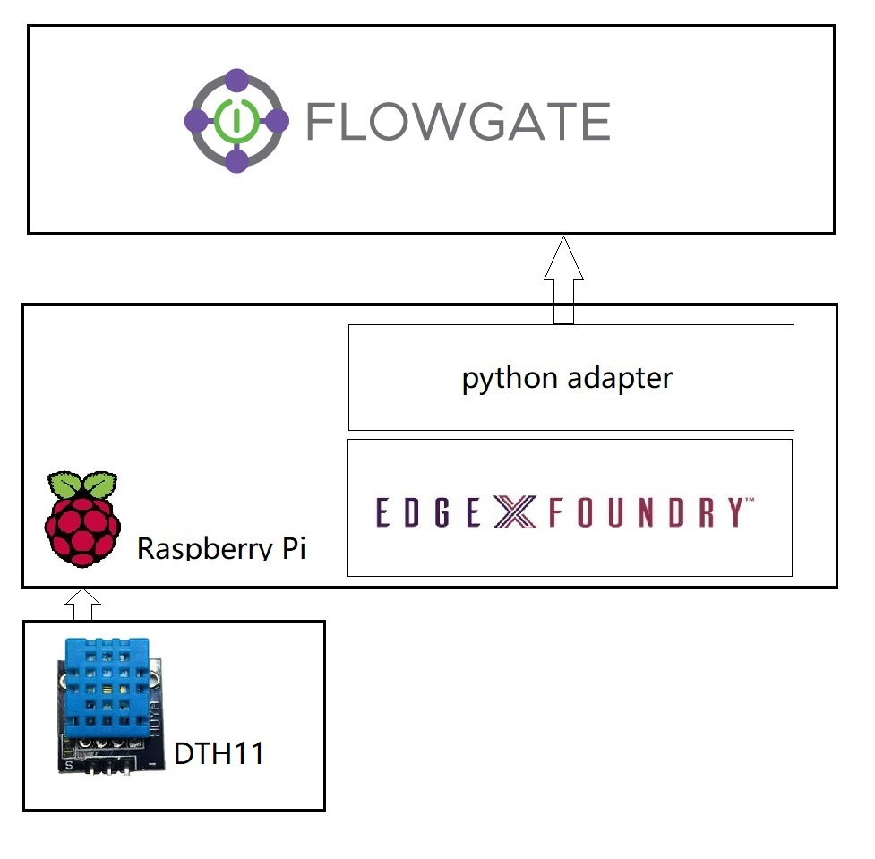
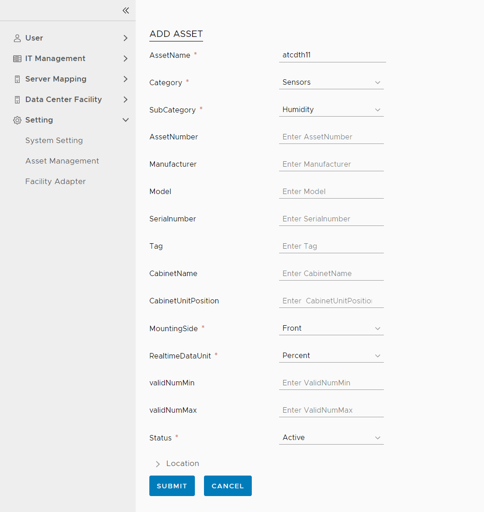
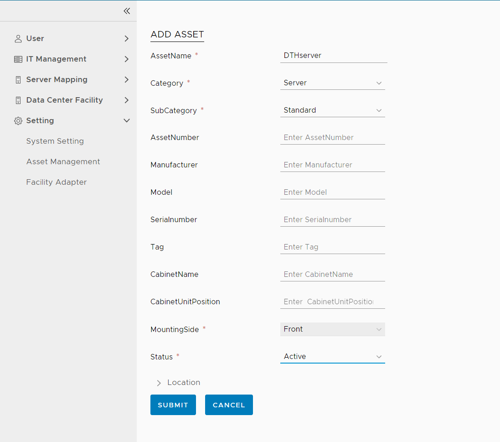
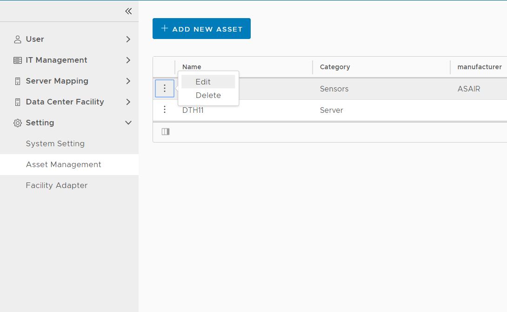
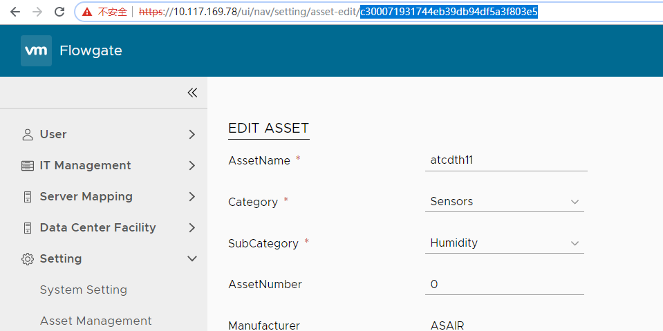
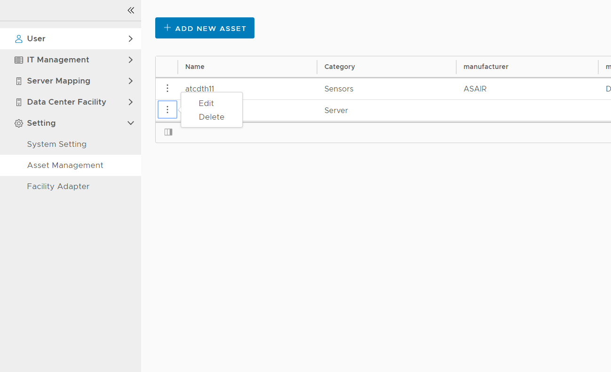
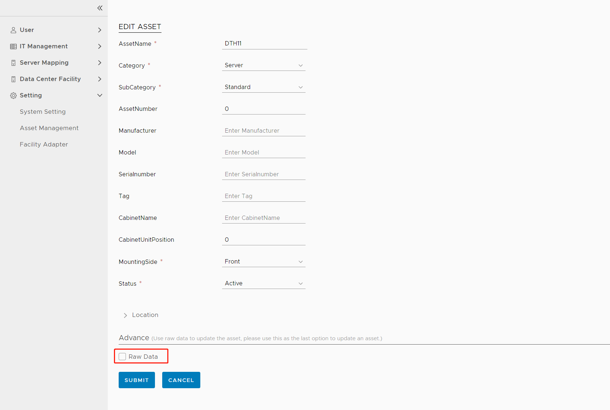
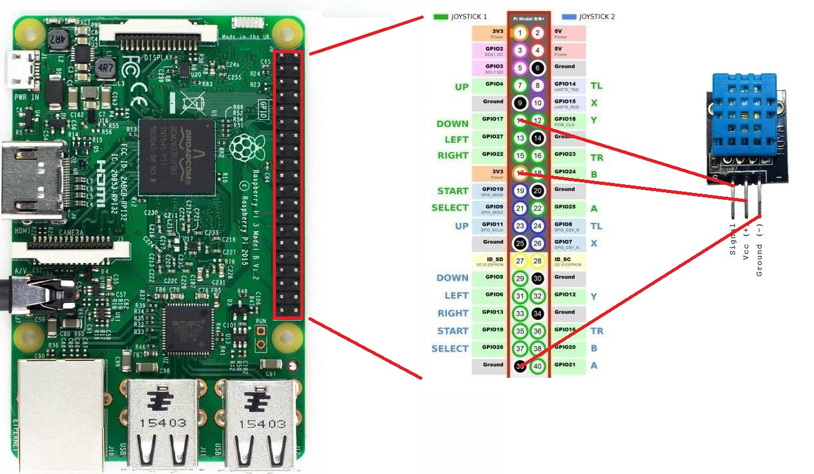

# Integrate with edgexFoundry sample


## Prerequisites
1. EdgexFoundry on Raspberry Pi.
2. Flowgate service.

### Hardware
1. Raspberry Pi 3B+
2. DHT11 sensor
### Software
|Software|Version|Description|
|---|---|---|
|python|version 3.5.2 or higher|For installation instructions, please refer to: https://www.python.org/|
|python3-pip|version 8.1.1|For installation instructions, please refer to: https://pypi.org/project/pip/|

## Integration Steps

1. Register deviceprofile  
You can use postman or curl to call the following API.
* URL: http://[your EdgexFoundry host]:48081/api/v1/deviceprofile
* method: POST
* body:
```
{
  "description": "DTH11 sensor via Raspberry Pi 3B+ and GPIO pins",
  "labels": [
    "GPIO",
	"DTH11"
  ],
  "manufacturer": "VMware OCTO",
  "model": "DTH11",
  "name": "GPIO_DTH11_Profile"
}
```

2. Create addressable  

* URL: http://[your EdgexFoundry host]:48081/api/v1/addressable
* method: POST
* body:
```
{
  "name": "DTH11 controller"
}
```

3. Create device service

* URL: http://[your EdgexFoundry host]:48081/api/v1/deviceservice
* method: POST
* body:
```
{
	"name": "DTH11Service",
	"description": "Manage DTH11 humidity and temperature", 
	"labels": [
		"GPIO",
		"DTH11"
	],
	"adminState": "locked",
	"operatingState": "enabled",
	"addressable": {
		"name": "DTH11 controller"
	}
}
```
5. Register device

* URL: http://[your EdgexFoundry host]:48081/api/v1/device
* method: POST
* body:
```
{
	"name": "atcdth11",
	"description": "humidity and temperature for atc", 
	"adminState": "locked",
	"operatingState": "enabled",
	"addressable": {
		"name": "DTH11 controller"
	},
	"labels": [
		"GPIO",
		"DTH11"
	],
	"service": {
		"name": "DTH11Service"
	},
	"profile": {
		"name": "GPIO_DTH11_Profile"
	}
}
```
6. Register export client

* URL: http://[your EdgexFoundry host]:48071/api/v1/registration
* method: POST
* body:
```
{
    "name": "FlowgateClient",
    "addressable": {
        "name": "FlowgateEventReceiver",
        "protocol": "HTTP",
        "method": "POST",
        "address": "[your adapter host]",
        "port": 8080,
        "path": "/event"
    },
	"format": "JSON",
	"filter": {
		"deviceIdentifiers": [
			"atcdth11"
		]
	},
	"enable": true,
	"destination": "REST_ENDPOINT"
}
```
7. Register sensor in Flowgate  
Use flowgate (Setting -> Asset Management), add new asset:  
  
Then, submit.

8. Register server in Flowgate  
Use flowgate (Setting -> Asset Management), add new asset:  
  
Then, submit.

9. Mapping server and sensor  
On asset management page, click edit of sensor:  
  
You will get the asset id in url:  
  
Then, edit the server called DTH11, 
  
Click raw data checkbox,
 
Replace the id in json with the id from the previous step, then put following json in the red area:  

```

"SENSOR": {
    "FrontHumidity": {
        "INLET": "c300071931744eb39db94df5a3f803e5"
    }
}

```  

  

10. Deploy adapter  

* Configure flowgate config  
modify flowgate/contrib/EdgeXfoundry/app/api/config.py with your flowgate environment.  

* Run adapter  
copy flowgate/contrib/EdgeXfoundry/app folder to your system, and run:
```
cd app
pip3 install -r requirements.txt
python3 adapter.py &
```

11. Start sensor collector  
* Connect the DTH11 sensor to the Raspberry Pi, as the following:
  

* Make the program boot automatically   
```
cp flowgate/contrib/EdgeXfoundry/conf/sensordata.service /usr/lib/systemd/system/
systemctl enable sensordata.service
```

* Run sensor collector  
```
mkdir /home/python_sensor
cp flowgate/contrib/EdgeXfoundry/sensor/DTH11.py /home/python_sensor/
systemctl start sensordata.service
```
## Check Result
1. On asset management page, click edit of server:  
  
You will get the asset id in url:  
  

2. Use postman or curl to call the following API.  
* https://[flowgate host]/apiservice/v1/assets/server/e28dff2d3ba34536835b760235aa0355/realtimedata?starttime=[now time]&duration=7200000  
* method: GET

Then, you can get the realtime data:  
```
[
    {
        "metricName": "FrontHumidity|INLET",
        "valueNum": 2.0,
        "value": null,
        "timeStamp": 1598550730346
    }
	...
]
```
## Refer
Please refer to https://github.com/yixingjia/wormhole/releases/download/1.0/VBC_Demo_0.5_720.mp4