- [Customer Adapter Setup Guide](#customer-adapter-setup-guide)
  - [About This Setup Guide](#about-this-setup-guide)
  - [Demo Video](#demo-video)
  - [Create An Adapter In Your Flowgate Service](#create-an-adapter-in-your-flowgate-service)
    - [Prerequisites](#prerequisites)
    - [Create An Adapter](#create-an-adapter)
  - [Implement Your First Adapter](#implement-your-first-adapter)
    - [How Your Adapter Work](#how-your-adapter-work)
    - [Download And Config The Adapter-Sample Project](#download-and-config-the-adapter-sample-project)
    - [Modeling Your Resource](#modeling-your-resource)
    - [Flowgate Data Model](#flowgate-data-model)
    - [Implement Adapter API-Client](#implement-adapter-api-client)
    - [Implement Your Customer Command Job](#implement-your-customer-command-job)
    - [Build Your Adapter](#build-your-adapter)
  - [Deploying](#deploying)
  - [Create A Integration](#create-a-integration)
  - [Verify That Your Adapter Works](#verify-that-your-adapter-works)
  - [Troubleshooting](#troubleshooting)

## Customer Adapter Setup Guide

###	About This Setup Guide

The Customer Adapter Setup Guide introduces the process of data integration solution that integrate customer system data with flowgate system.
It shows how to create an adapter, package it for deployment, and deploy it in a flowgate service. 

To help you get started with developing your solution,this guide provides information about installing a flowgate service and creating an adapter.

### Demo Video 

This video introduces how to implement your own adapter, you can follow the steps of the video, or you can implement your adapter according to the following document content

[Demo video of adapter-sample](https://github.com/Pengpengwanga/flowgate-1/releases/download/1.0/AdapterDemo.mp4)

### Create An Adapter In Your Flowgate Service

Your adapter is part of the Flowagte service. For each customer Adapter, Flowgate will generate unique configuration information for it, so you need to deploy a Flowgate Service and create your adapter on the corresponding page.

#### Prerequisites 

You need to install a flowgate service, and you have two ways to install it as below.

1. **Install from Source code**
[Compile document](compile_guide.md)

2. **Install from binary**
[Install document](installation_guide.md)

#### Create An Adapter

1. Login your flowgate web UI with your username and password
   

2. Go to the Facility adapter list page

	
	
3. Click New Facility Adapter
	
	a) The adapter type and display name is required
	
	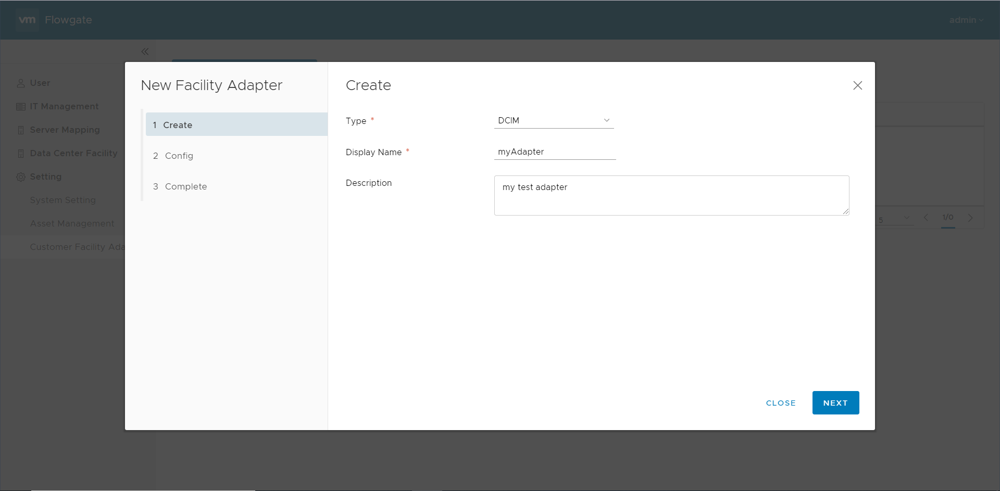
	
4. Config your adapter

	a) You can click 'ADD COMMAND' button to create a command if you need.
	
	b) The command name and trigger cycle is required.
	
	c) Click 'ADD' button to confirm add a command
	
	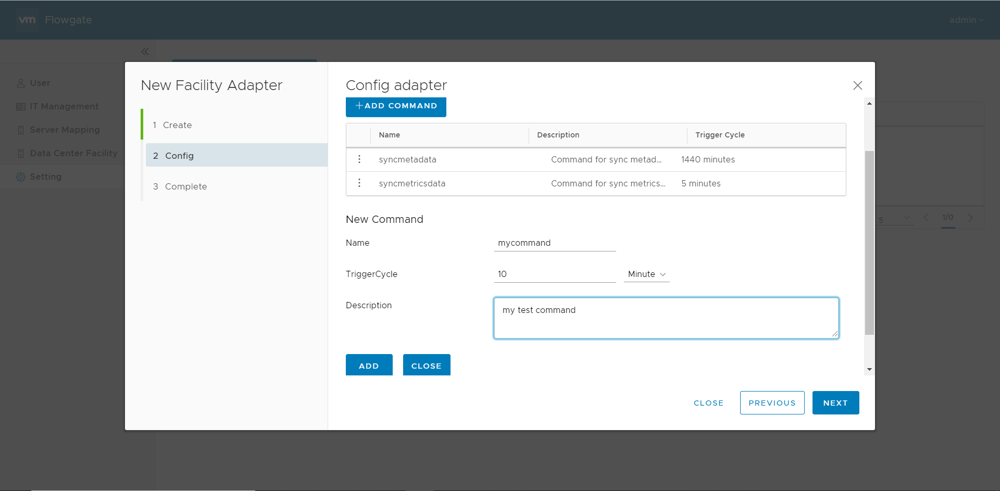
	
5. Complete

	Double check your configurations
	
	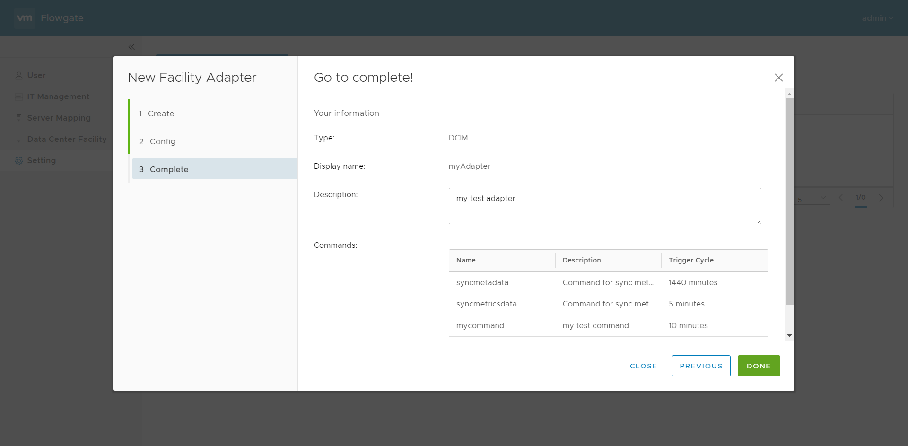
	
### Implement Your First Adapter

Your adapter will become a part of Flowgate. The Flowgate service will periodically send requests to notify your adapter to work. When your adapter receive a notify message, your adapter will parse the message and execute the corresponding job according to the command in the message body. Depending on your needs, you may have multiple jobs. In these jobs, you may call your apis to read data from your system, and then process them, and finally store them in the flowgate system by calling the api of flowgate.

To develop your adapter you can manually edit sample adapter code, and create some new data models and create some new apis to get data from your system and implement your custom command job.

This chapter includes the following topics: 

* How Your Adapter Work
* Download And Config The Adapter-Sample Project
* Modeling Your Resource
* Flowgate Data Model
* Implement Adapter API-Client
* Implement Your Custom Command Job
* Build Your Adapter

#### How Your Adapter Work

 **Data Flow Overview**

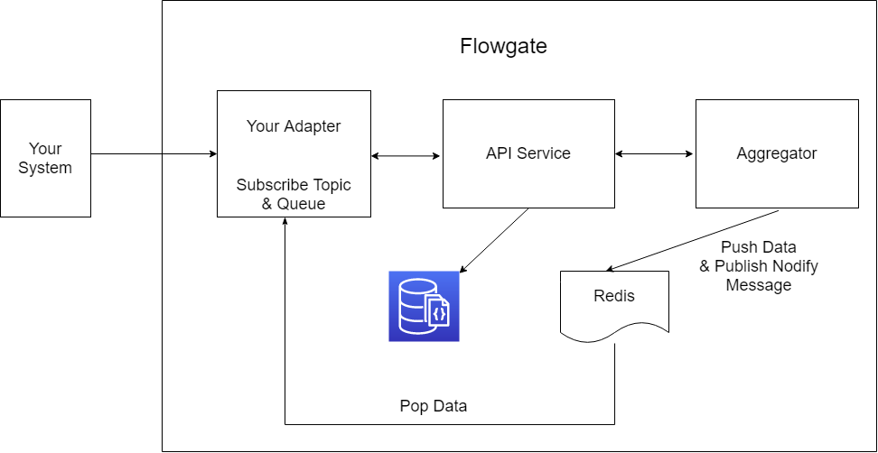

Your Adapter will read data from your system, and read data from Flowgate, then compare and integrate the data, and then save it to Flowgate

#### Download And Config The Adapter-Sample Project

**Prerequisites** 

1. Verify that the JDK1.8 or above is installed.
2. Verify that the Eclipse IDE or other IDEs for Java Developers is installed. 
3. Verify that the Git is installed.
4. Verify that the Maven is installed.

**Procedure**

1. Clone the project form github.

   a) Open a terminal

      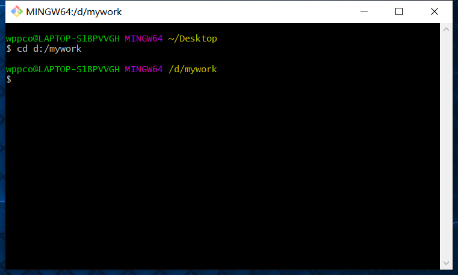

      >#> `git clone https://github.com/vmware/flowgate.git` 

       
      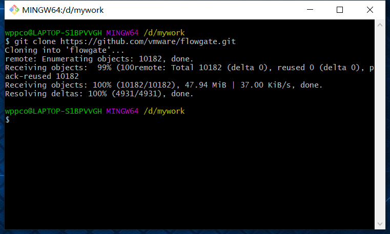

2. Move to your project directory and install dependency packages for flowgate-api and vc-worker and vro-worker

    **For example:**

    >#> `cd flowgate/flowgate-api`

    >#> `mvn initialize`

    >#> `cd ../vc-worker`

    >#> `mvn initialize`

    >#> `cd ../vro-worker`

    >#> `mvn initialize`

3. Open the IDE and import the project


3. Modify the configuration file

    * The application.properties flie before updating.

      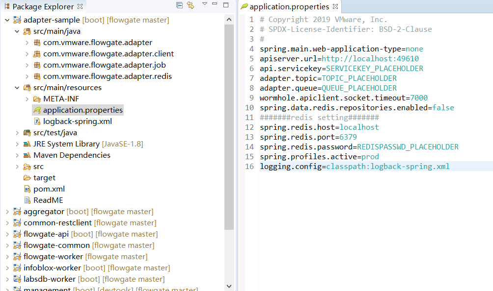

    * Go to the adapter-list page and select your adapter and click show detail

      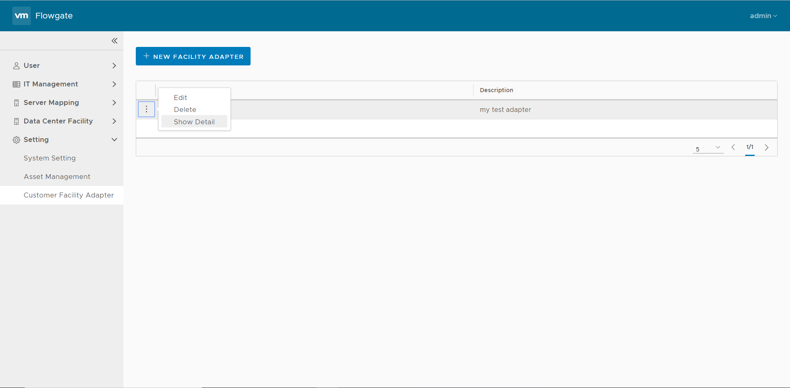


    * The api.serviceKey and adapter.queue and adapter.topic configuration items in the configuration file correspond to serviceKey/Queue Name/Topic in the detail page, respectively

      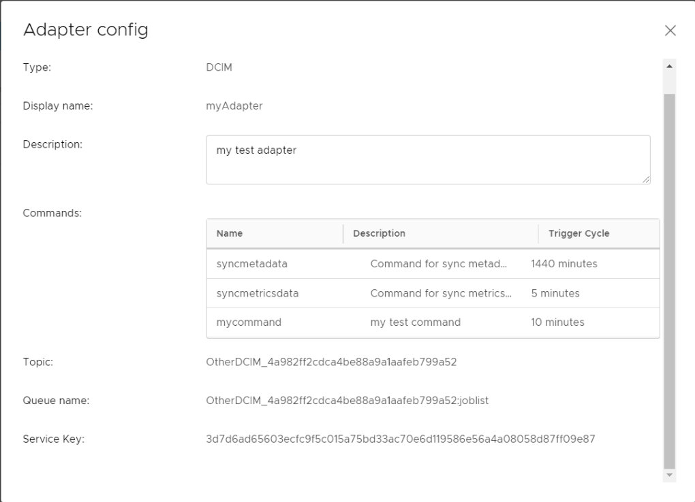

    * Modify your redis password
   

#### Modeling Your Resource

  * First you need to define some data models to receive the data returned from your api.
  * You can create a new package to store your data model.

    For example:

    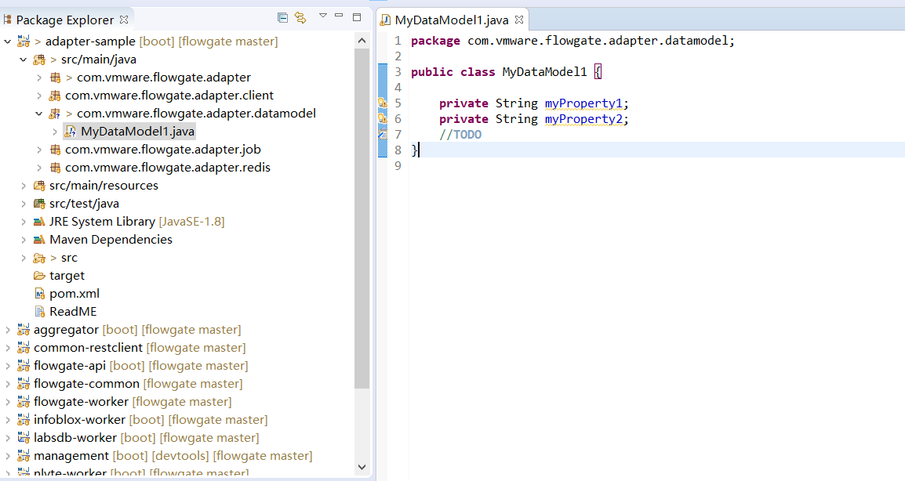

#### Flowgate Data Model

Depending on your needs, you may use the following data model. If your adapter is Facility-related, FacilitySoftwareConfig will be used. If your task is to synchronize metadata, Asset will be used. If your task is to synchronize indicator data, the RealtimeData and ValueUnit will be used.

   * Open the flowgate-common project,there are all flowgate data models you may use.

      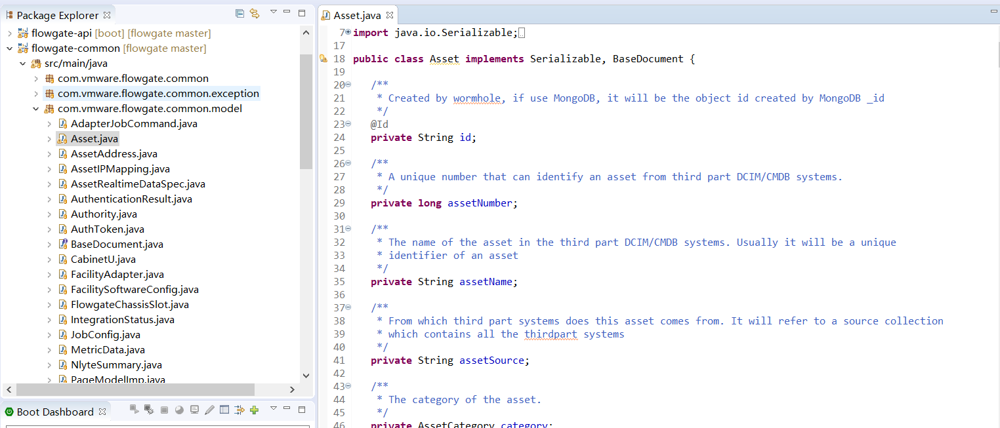

   * Login your flowgate service and open the API document

     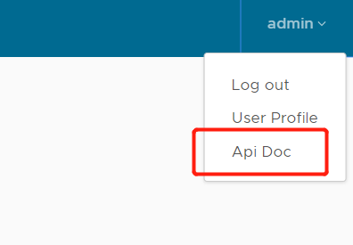 

   * In this document you can find a detailed introduction to the data model and all flowgate APIs.

      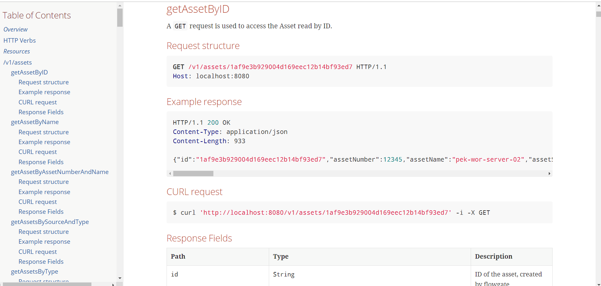

#### Implement Adapter API-Client
  In order to get the data of your system, you need to configure a client to access your system.

  * Open the AdapterClient.java, You need to specify some APIs for obtaining datas.

    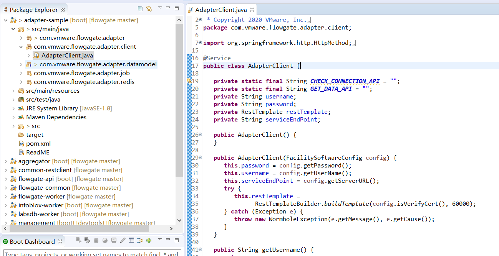  
  
  * You can defined your methods to check connection and get your datas, the method of check connection is to check whether the customer API service can provide services normally

    For Example:

    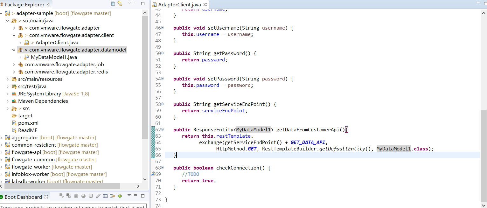
  
#### Implement Your Customer Command Job 

The syncmetadata command is planed to sync the asset metadata information. The syncmetricsdata command is planed to sync the metrics data. If you defined other commands, you can implement them in the AdapterJobService.java

* The job of sync metadata

  For example:
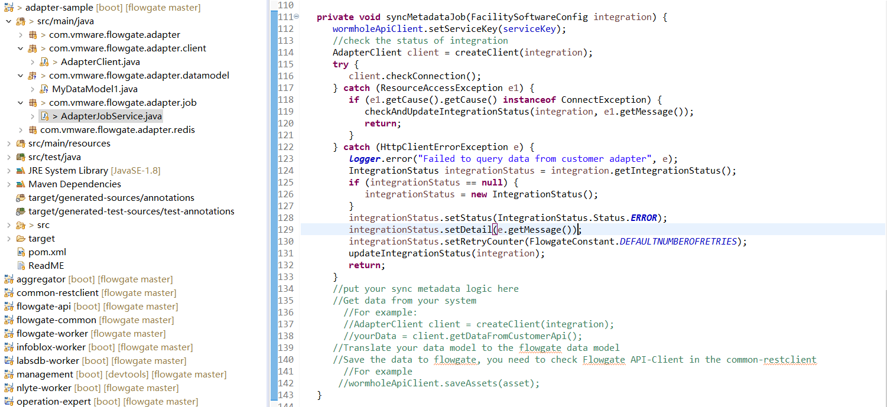

* If you have other commands, you can implement them.
  For example:
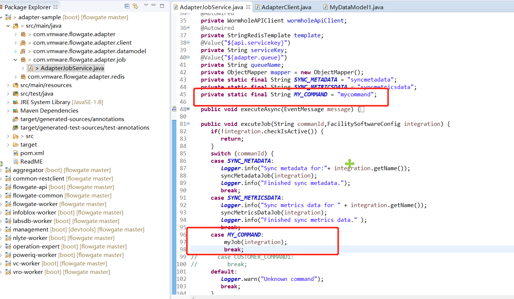


* In order to communicate with Flowgate api, you need a Flowgate api client. The common-restclient project is that we have implemented a general flowgate api client. You only need to find the methods you may use in WormholeAPIClient.java. 

* Open the WormholeAPIClient.java

  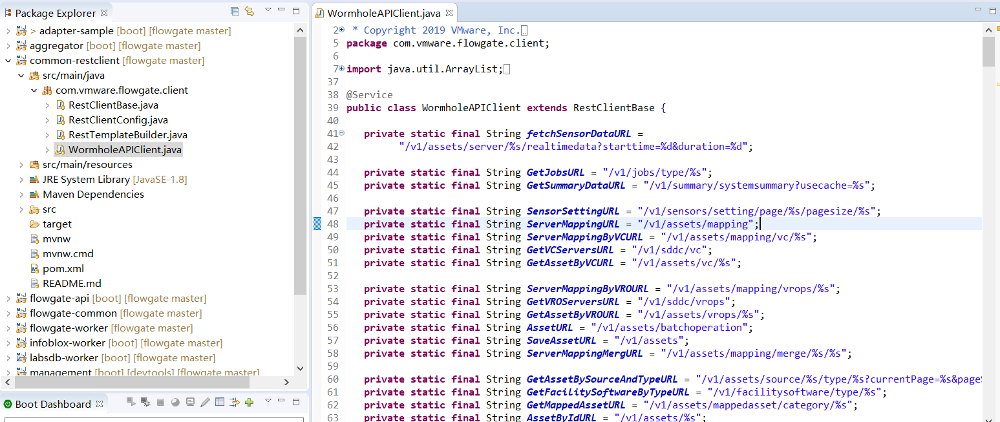

* Accord to your adapter commands to implement your logic in the excuteJob method.

  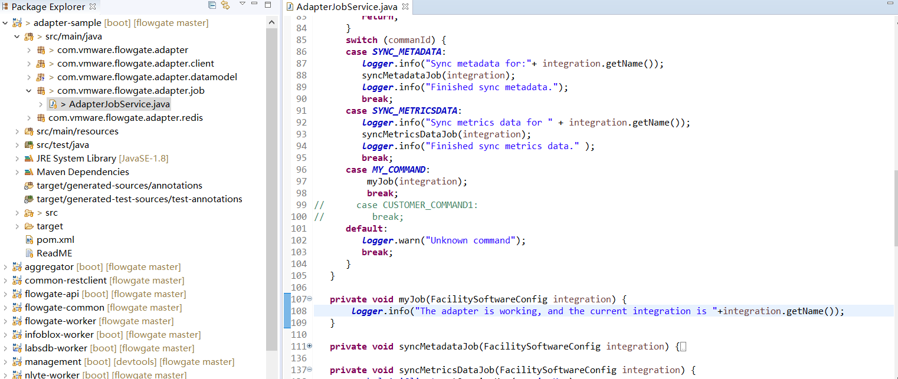

#### Build Your Adapter

The adapter-sample is depends on the package of flowgate-common and common-restclient, so we need to generate these packages.

**Install Dependency Package**

  * Move to your project directory and install flowgate-common

    **For example:**

    >#> `cd flowgate-common`

    >#> `mvn install`

    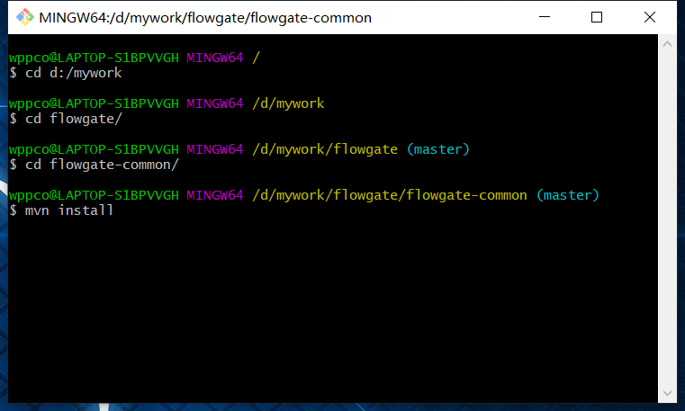

 * Install common-restclient

    **For example:**

    >#> `cd ../common-restclient`

    >#> `mvn install`

    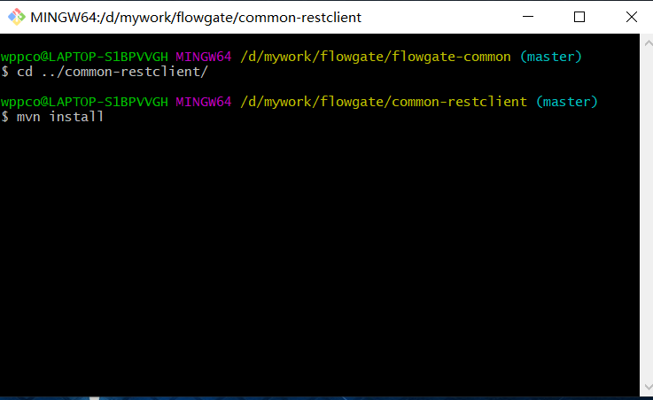

**Build Adapter-Sample.jar**

* Package the adapter-sample project

    **For example:**

    >#> `cd ../adapter-sample`

    >#> `mvn package`

    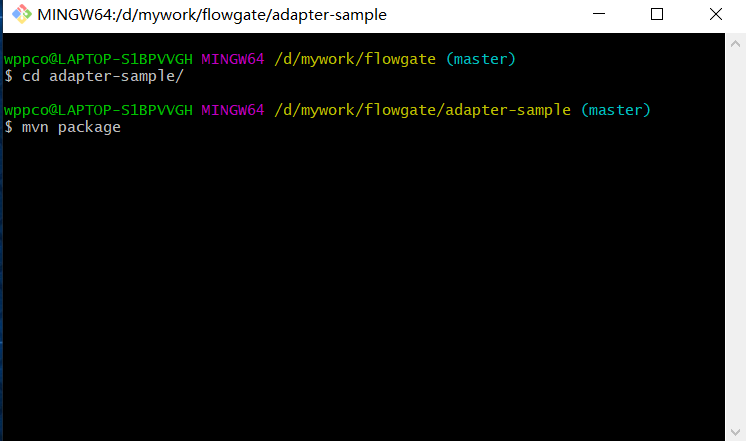

* You can find adapter-sample-1.0.0.jar here

    **For example:**

    >#> `cd adapter-sample/target/`

  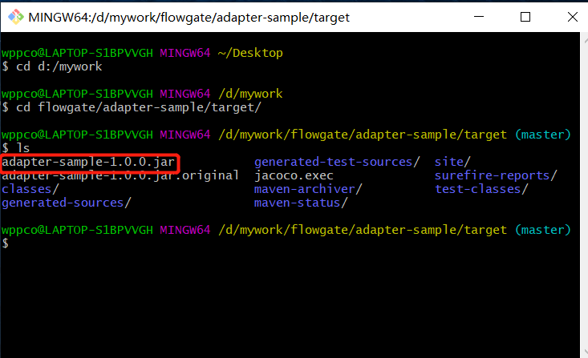

**Build Docker Image**

Flowgate is deployed as multiple Docker containers, so we recommend that you run the adapter project as a Docker container. You need to prepare an ubuntu server or other linux server in advance to build the docker image. Please install the following prerequisites in the build server:

Software              | Required Version
----------------------|--------------------------
ubuntu                | 16.04 +
docker                | 18.09.1 +

  * Create a new directory

     For example:
    >#> `mkdir adapter`

* Create a file named Dockerfile and paste the following content into it
  
  ```shell
  FROM photon:2.0
  
  RUN tdnf distro-sync -y \
	&& tdnf install openjre8.x86_64 -y \
	&& mkdir /log \
	&& mkdir /jar \
	&& mkdir /conf
	
  VOLUME /log /conf 
  COPY adapter-sample*.jar /jar/adapter-sample.jar
  WORKDIR /
  ENTRYPOINT [ "java", "-jar", "/jar/adapter-sample.jar", "--spring.config.location=/conf/application.properties" ] 
  ```

  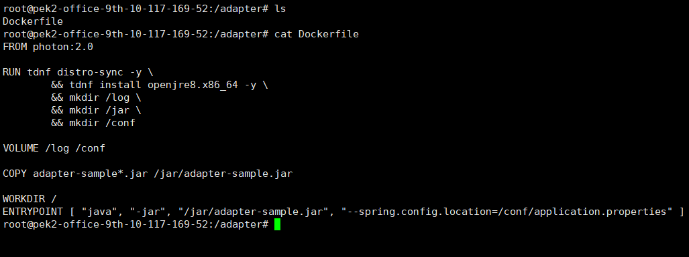

* Move the adapter-sample-1.0.0.jar to the same directoy with the Dockerfile

  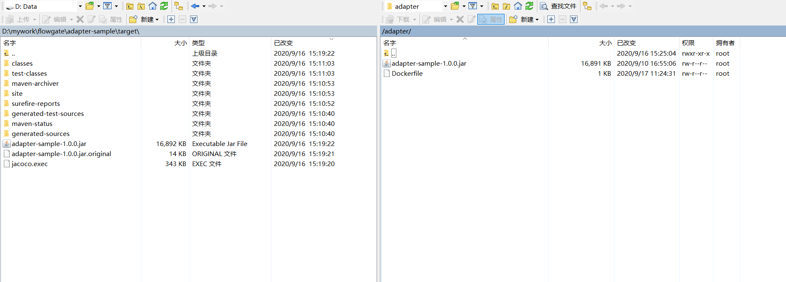

  >#> `ls`

  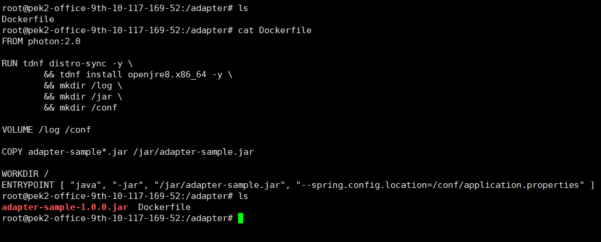

* List existing Docker images

  >#> `docker image ls`

  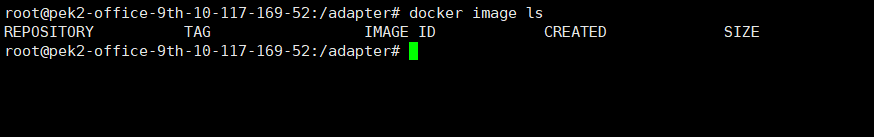

* Build

  >#> `docker build -t flowgate/adapter-sample:v1.0 .`

  
  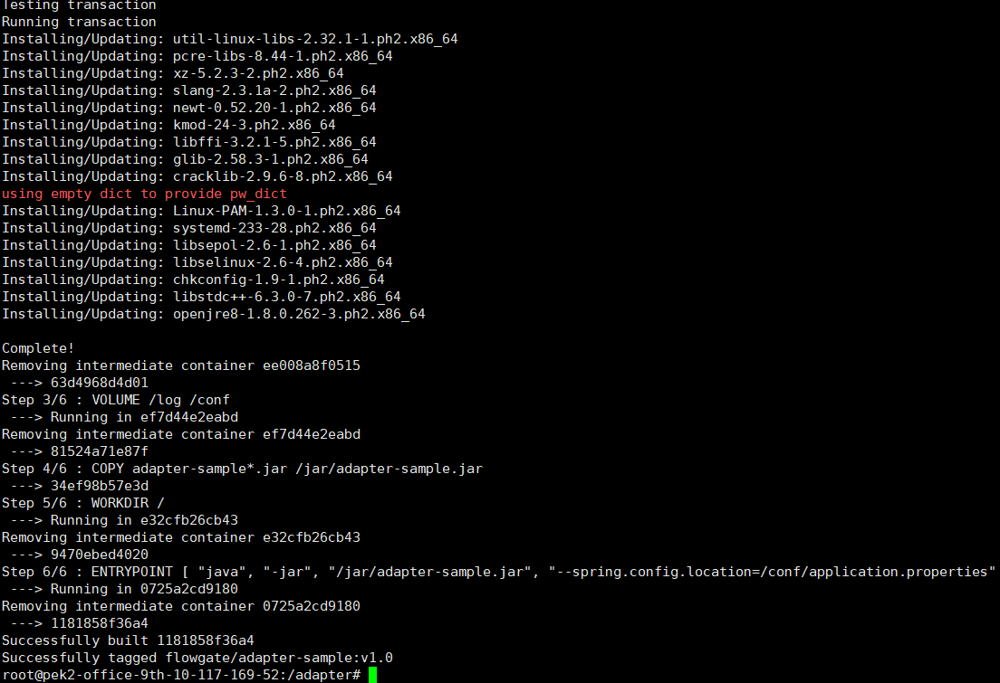

  >#> `docker image ls`

  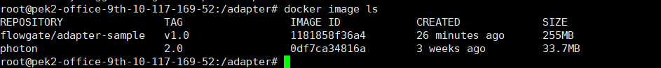

* Save

  >#> `docker save -o adapter.tar flowgate/adapter-sample:v1.0`

  >#> `ls`

  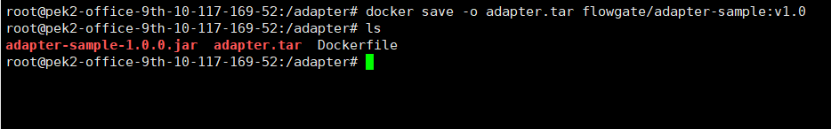

### Deploying

Now we have adapter-sample.jar and docker image, we have two ways to deploy it, one is to run the jar directly with java command, and the other is to run the docker container. We recommend using the docker container to deploy this project.

* Using java -jar

    1. Verify that the JDK1.8 or above is installed.

    2. Create a directory on your flowgate

        For example:
        >#> `mkdir adapter-sample` 

    3. Move jar file to the adapter-sample

    4. Move you application.properties to the same directory,and modify these configurations

    5. Run the jar

        >#> `java -jar adapter-sample-1.0.0.jar`

* Using docker container

  1. Copy the adapter.tar to your flowgate server,and copy your application.properties from your adapter-sample project directory to your flowgate server.

      **For example:**

      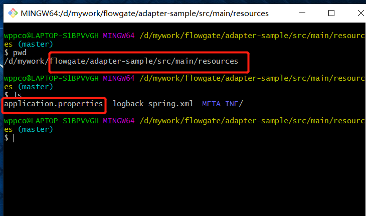

      >#> `cd /opt/vmware/flowgate`

      >#> `ls`

      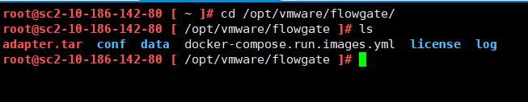

  2. Load image from adapter.tar

      >#> `ls`

      >#> `docker image ls`

      >#> `docker load -i adapter.tar`

      >#> `docker image ls`

      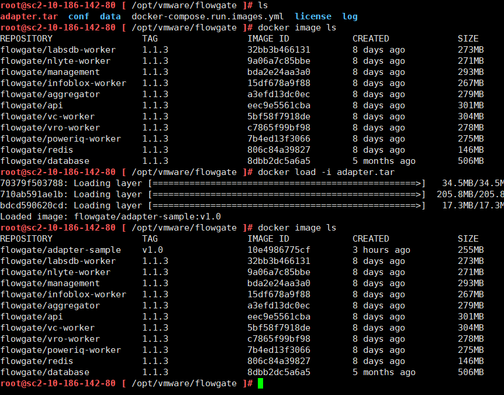

  3. Create some diretory to save config files and log files for adapter-sample

      >#> `mkdir conf/adapter-sample`
      
      >#> `ls`
      
      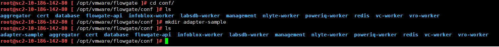

      >#> `mkdir  log/adapter-sample`

      >#> `ls`

       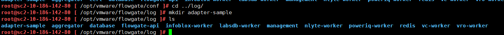
  
  4. Copy the adapter-sample's application.properties to '/opt/vmware/flowgate/conf/adapter-sample' and modify it.
  
      >#> `cd /opt/vmware/flowgate/conf/adapter-sample`

      >#> `ls`

      >#> `cat application.properties`

      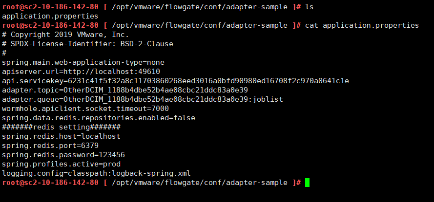

      There are three values that need to be modified, namely 
      >#> `apiserver.url=`
      
      >#> `spring.redis.host=`
      
      >#> `spring.redis.password=`
      
      We can find the corresponding values in the configuration files of other adapters. For example:

       >#> `cat ../poweriq-worker/application.properties` 

      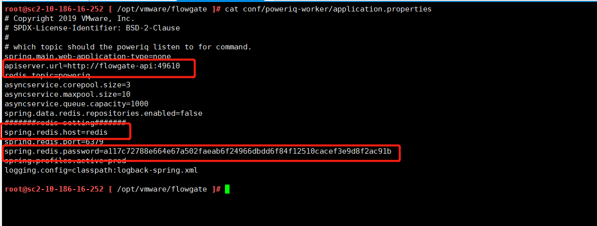
      
      Modify the application.properties in adapter-sample.

      >#> `vi application.properties`

      >#> `cat application.properties`

      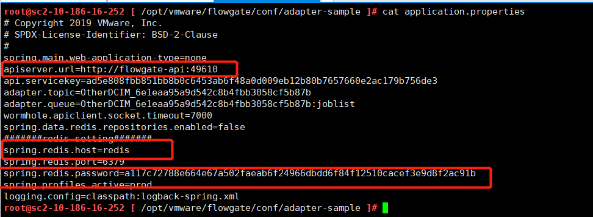

  5. Modify the docker-compose.run.images.yml

      >#> `cd /opt/vmware/flowgate`

      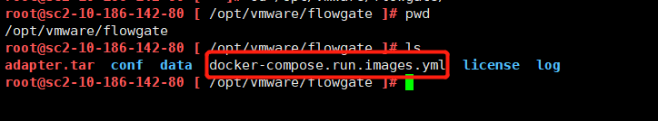

      >#> `vi docker-compose.run.images.yml`

      Copy the following content into this file
  
      ```yml
      sample-adapter-worker:
      image: flowgate/adapter-sample:v1.0
      volumes:
        - /opt/vmware/flowgate/log/adapter-sample:/log
        - /opt/vmware/flowgate/conf/adapter-sample:/conf
      container_name: flowgate-adapter-sample--container
      networks:
        - services-network
      depends_on:
        - redis
        - flowgate-api
      links:
        - redis:redis
        - flowgate-api:flowgate-api
      ```

      >#> `cat docker-compose.run.images.yml`
      
      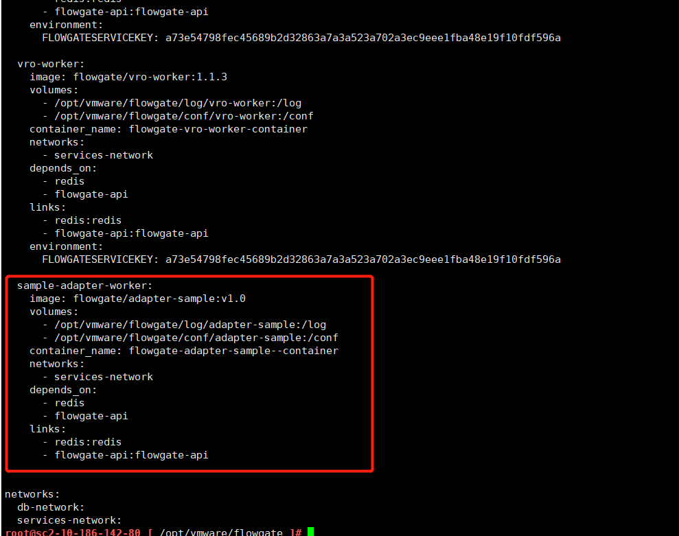

  6. Run

      >#> `docker ps`

      >#> `docker-compose -f docker-compose.run.images.yml up -d sample-adapter-worker`

      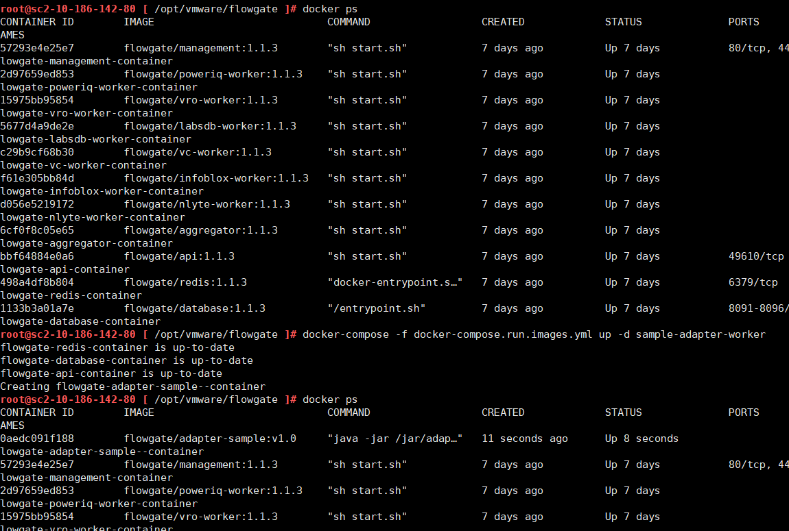

  7. Start up succuss

      >#> `docker ps`

      >#> `docker logs flowgate-adapter-sample--container`

      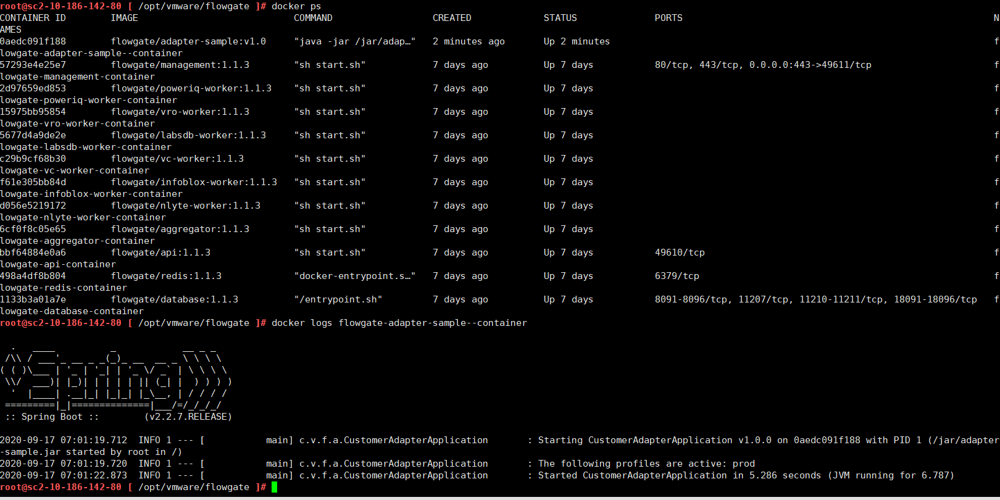

### Create A Integration

1. Login your flowgate web ui
2. Jump to the list page of facility integrations

    If your adapter type is OtherDCIM you should go to the list page of DCIM and it your adapter type is OtherCMDB you should go to the list page of CMDB.

    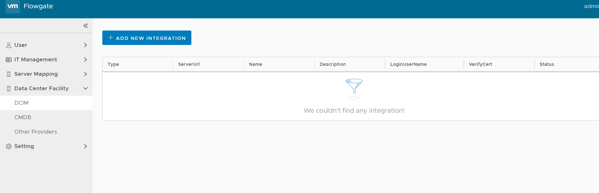

3. Click 'Add New Integration'
4. Select your adapter
5. This integration is used to config a client to visit your system, so the your Server Ip/Name/Username/password is required
   
      

6. Click submit to save the interation

    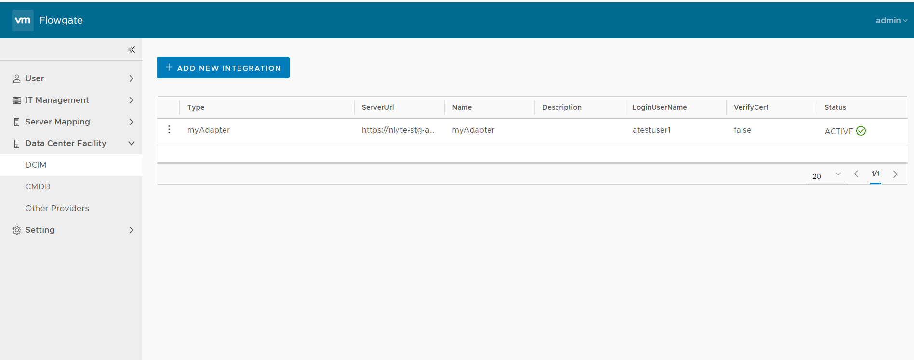

### Verify That Your Adapter Works

  About five minutes after the startup is complete, you can view the running results.

* Login your flowgate server and check whether the info log output cycle and output content are correct.

    >#> `cd /opt/vmware/flowgate/log/adapter-sample/`

    >#> `cat adapter-sample-info.log `

    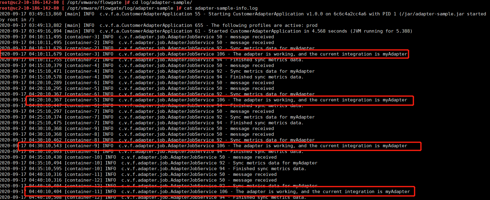

According to our previous configuration, the execution cycle of the job of syncmetricsdata is every five minutes, and mycommand is executed every ten minutes. From the log file, it can be seen that the output result is correct.

### Troubleshooting

When your adapter is not running normally, you can check the log to see what happened.

  >#> `cd /opt/vmware/flowgate/log/adapter-sample/`

  >#> `cat adapter-sample-info.log `

  >#> `cat adapter-sample-error.log `
